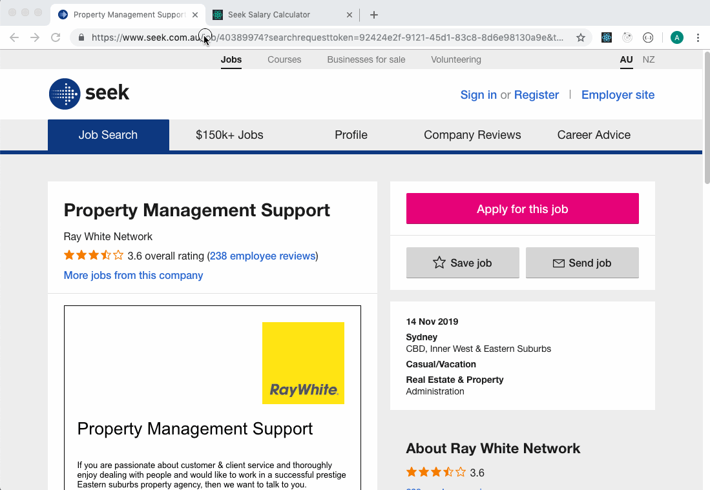

# RevSeek

For Australians looking at job ads on Seek, it's sometimes not obvious what the expected salary range for the advertised position is. With some search filter trickery you can often determine an accurate range for the salary but this process can be a little bit cumbersome.

I created this small app to streamline that process. All you need is the full URL for the job listing and then you let the app work its magic! 🤘

The logic for this app is largely borrowed from this bash script:
https://github.com/b3n-j4m1n/salary-seeker

This project was bootstrapped with [Create React App](https://github.com/facebook/create-react-app).

---

## Setup

1. Clone the repo and navigate to the folder
2. Install project dependencies with: `npm i`
3. Start the server and launch the app: `npm start`

---

## Usage

1. Complete the setup steps above
2. In your browser, visit a job ad on Seek that you want to know the salary range for and copy the full URL
2. Open another browser tab and visit `http://localhost:3000`
3. Paste the URL into the input the field and press the **Calculate Salary Range** button